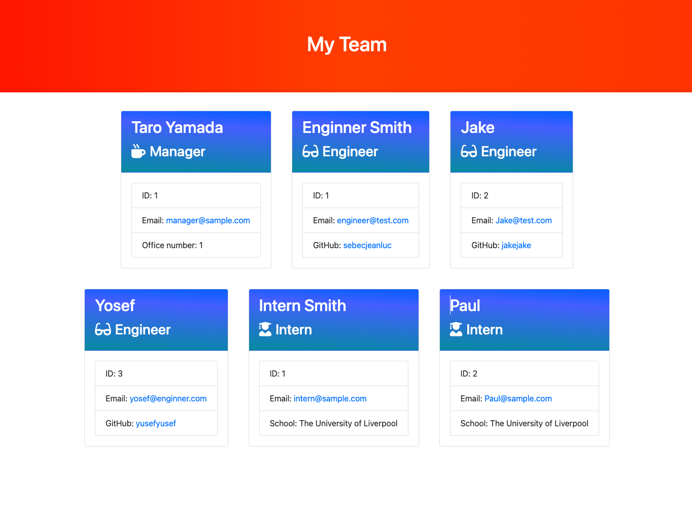

<!-- TABLE OF CONTENTS -->
  <details>
    <summary>Table of Contents</summary>
    <ol>
      <li>
        <a href="#about-this-project">Team Profile Generator</a>
        <ul>
          <li><a href="#built-with">Built With</a></li>
        </ul>
      </li>
      <li><a href="#how-to-install">How to install</a></li>
      <li><a href="#usage">Usage</a></li>
      <li><a href="#important-note">Important Note</a></li>
      <li><a href="#website-preview">Website Preview</a></li>
      <li><a href="#credits">Credits</a></li>
      <li><a href="#license">License</a></li>
      <li><a href="#contact">Contact</a></li>
    </ol>
  </details>

## Team Profile Generator

[](https://opensource.org/licenses/MIT)

### About this Team Profile Generator project

This project involves the creation of a Node.js command-line application designed to handle and process information about employees in a software engineering team. The essential task of this application is to take specific details about each team member, such as their name, role, ID, email, and other role-specific information, and use this data to generate an HTML webpage. This webpage will display summarized profiles for each team member. An integral part of the project is ensuring that the application passes a series of provided tests, indicating that each segment of the code functions as intended.

### Built With

- ![HTML]
- ![CSS]
- ![BOOTSTRAP]
- ![JAVASCRIPT]
- ![NODEJS]

### How to install

```shell
npm init -y
npm install inquirer@6.3.1
npm install jest

Uptade: the file package-json line 10 to: "test": "jest"

npm run test
touch ./.gitignore

Add: node_modules

```

### Usage

On the terminal(for MacOS), you can run `node index.js` and answer the following questions. After that, you can check the folder called output and you can find the team.html file as the result.

### Mock-up

### Important note

Validation only works for the number.

### Website preview



### Third-party services

- [inquirer - npm](https://www.npmjs.com/package/inquirer)

### Credits

- Tak Kawamura

### Test

In the root directory,
run `npm run test`

### License

Copyright(c) 2024,
All rights reserved

This source code is licensed under the MIT license.
More detail can be found in the LICENSE file in the root directory of this source tree if the link of the badge is not available.

## Questions

### Contact

Tak Kawamura - tkawamura11@gmail.com

[Tak Kawamura on Linkedin](https://linkedin.com/in/tkawamura11@gmail.com)

[sebecjeanluc on Github](https://sebecjeanluc.github.io/sebecjeanluc/)

<!-- MARKDOWN LINKS & IMAGES -->
<!-- https://www.markdownguide.org/basic-syntax/#reference-style-links -->

[HTML]: https://img.shields.io/badge/HTML-orange
[CSS]: https://img.shields.io/badge/CSS-blue
[BOOTSTRAP]: https://img.shields.io/badge/BOOTSTRAP-lightblue
[JAVASCRIPT]: https://img.shields.io/badge/Javascript-yellow
[JQUERY]: https://img.shields.io/badge/JQUERY-lightblue
[DAYJS]: https://img.shields.io/badge/DAYJS-orange
[WEBAPI]: https://img.shields.io/badge/WEBAPI-orange
[NODEJS]: https://img.shields.io/badge/NODEJS-green
